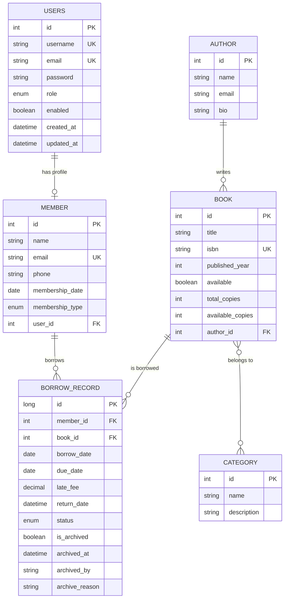

# Library Management System — REST API

A production-grade **Library Management System** built with **Spring Boot 4.0.1** and **Java 25**, featuring JWT-based authentication, role-based access control, tiered memberships, borrow tracking with automated late-fee calculation, and rich filtering/pagination across all resources.

---

## Key Features
| Area | Highlights |
|------|-----------|
| **Authentication** | JWT token-based auth with secure registration & login |
| **Authorization** | Role-Based Access Control — `ADMIN`, `LIBRARIAN`, `MEMBER` |
| **Books** | Full CRUD, ISBN-unique, multi-category tagging, copy tracking |
| **Authors** | CRUD with linked book listings |
| **Categories** | CRUD with many-to-many book relationships |
| **Members** | Profile management linked to user accounts |
| **Membership Tiers** | `BASIC` (3 books/7 days) · `STANDARD` (5 books/14 days) · `PREMIUM` (10 books/30 days) |
| **Borrow Records** | Borrow → Return → Archive lifecycle with overdue detection |
| **Late Fees** | Auto-calculated at ₹1/day, capped at ₹100 |
| **Email Notifications** | Welcome emails, borrow confirmations, return receipts, overdue reminders |
| **Pagination & Sorting** | Configurable on all list endpoints |
| **Advanced Filtering** | Multi-field search using JPA Specifications |
| **Global Error Handling** | Centralized exception handling with structured JSON responses |
| **Input Validation** | Group-based validation (Create vs Update) with descriptive messages |
| **Scheduled Tasks** | Automated overdue detection and late fee calculation |
| **API Documentation** | Interactive Swagger/OpenAPI documentation |
| **Comprehensive Logging** | Production-ready logging with SLF4J/Logback |
| **Unit Testing** | 206 tests across 6 service classes — JUnit 5 + Mockito + AssertJ |

---

## Tech Stack

| Layer | Technology |
|-------|-----------|
| **Framework** | Spring Boot 4.0.1 |
| **Language** | Java 25 |
| **Security** | Spring Security 6 + JWT (jjwt 0.13.0) |
| **ORM** | Spring Data JPA / Hibernate |
| **Database** | MySQL 8.0 |
| **Email** | Spring Boot Mail + Gmail SMTP |
| **API Docs** | Swagger/OpenAPI 3.0 (springdoc-openapi 2.3.0) |
| **Validation** | Jakarta Bean Validation |
| **Logging** | SLF4J + Logback |
| **Utilities** | Lombok |
| **Build Tool** | Maven 3.9+ |
| **Testing** | JUnit 5 + Mockito + AssertJ |

---

## Architecture

```
src/main/java/com/example/LibraryManagementSystem/
│
├── config/                  # Security config, JWT filter & utilities
│   ├── SecurityConfig.java
│   ├── JwtAuthenticationFilter.java
│   ├── JwtUtil.java
│   ├── JwtAuthenticationEntryPoint.java
│   ├── JwtAccessDeniedHandler.java
│   ├── CustomUserDetailsService.java
│   └── openAPI/OpenApiConfig.java
│
├── controller/              # REST API controllers
│   ├── AuthenticationController.java
│   ├── AuthorController.java
│   ├── BookController.java
│   ├── BorrowRecordController.java
│   ├── CategoryController.java
│   ├── MemberController.java
│   └── UsersController.java
│
├── model/                   # JPA entities
│   ├── Users.java           # Implements UserDetails
│   ├── Book.java
│   ├── Author.java
│   ├── Category.java
│   ├── Member.java
│   ├── BorrowRecord.java
│   └── MembershipType.java  # Enum with tier config
│
├── dto/                     # Request/Response DTOs & Mappers
│   ├── auth/
│   ├── BookDTO/
│   ├── authorDTO/
│   ├── borrowRecordDTO/
│   ├── categoryDTO/
│   ├── memberDTO/
│   ├── common/PageResponse.java
│   ├── mapper/
│   └── validation/ValidateGroups.java
│
├── exception/               # Global exception handling
│   ├── GlobalExceptionHandler.java
│   ├── ResourceNotFoundException.java
│   ├── ResourceAlreadyExistsException.java
│   ├── BookNotAvailableException.java
│   ├── BorrowLimitExceededException.java
│   ├── DuplicateBorrowException.java
│   └── ...
│
├── repository/              # Spring Data JPA repositories
│
├── service/                 # Business logic layer
│
├── specification/           # JPA Specifications for filtering
│   └── BookSpecification.java
│
└── scheduler/               # Scheduled tasks
    └── BorrowRecordScheduler.java
```

---

## Test Structure

```
src/test/java/com/example/LibraryManagementSystem/
│
└── service/                          # Unit tests — JUnit 5 + Mockito
    ├── AuthorServiceTest.java           26 tests
    ├── BookServiceTest.java             26 tests
    ├── CategoryServiceTest.java         31 tests
    ├── BorrowRecordServiceTest.java     62 tests
    ├── MemberServiceTest.java           42 tests
    └── UsersServiceTest.java            19 tests
                                      ─────────────
                                       206 tests total
```

---

## Unit Testing

All service-layer business logic is covered with **JUnit 5**, **Mockito**, and **AssertJ**.
No Spring context is loaded — tests run fast using `@ExtendWith(MockitoExtension.class)`.

### Tools & Annotations

| Tool / Annotation | Purpose |
|---|---|
| `@ExtendWith(MockitoExtension.class)` | Enables Mockito without loading Spring context — fast |
| `@Mock` | Creates a fake implementation of a dependency |
| `@InjectMocks` | Creates the real service and injects all mocks into it |
| `@Nested` | Groups related tests for readability |
| `@ParameterizedTest` | Runs the same test with multiple inputs |
| `@BeforeEach` | Rebuilds fixtures fresh before every test |
| `AssertJ` | Fluent, readable assertions (`assertThat`) |

### Running Tests

```bash
# Run all tests
mvn test

# Run a specific test class
mvn test -Dtest=AuthorServiceTest

# Run with coverage report (requires JaCoCo plugin)
mvn test jacoco:report
```

---

### AuthorService — 26 tests

| Method | Tests |
|---|---|
| `getAllAuthors()` | Returns mapped page · Caps pageSize at 50 · Falls back to `id` for invalid sortBy · Accepts all allowed sortBy fields · Applies descending sort · Returns empty page |
| `getAuthorById()` | Returns AuthorResponse when found · Throws `ResourceNotFoundException` when missing |
| `addAuthor()` | Saves successfully · Throws `ResourceAlreadyExistsException` for duplicate email · Skips email check when null · Skips email check when blank |
| `updateAuthor()` | Updates with same email · Updates with new unique email · Throws `ResourceAlreadyExistsException` for taken email · Throws `ResourceNotFoundException` when not found · Skips email check when null · Updates bio to null |
| `deleteAuthor()` | Deletes when no books · Throws `ConflictException` with one book · Throws `ConflictException` with multiple books · Throws `ResourceNotFoundException` when missing |

---

### BookService — 26 tests

| Method | Tests |
|---|---|
| `getAllBooks()` | Returns mapped page · Caps pageSize at 50 · Falls back to `id` for 4 invalid fields · Accepts all 7 allowed sortBy fields · Applies descending sort · Returns empty page |
| `getBookById()` | Returns BookResponse when found · Throws `ResourceNotFoundException` when missing |
| `addBook()` | Saves successfully · Throws `ResourceAlreadyExistsException` for duplicate ISBN · Throws `ResourceNotFoundException` when author missing · Throws `ResourceNotFoundException` for category mismatch · Skips category lookup when null · Skips category lookup when empty |
| `updateBook()` | Throws `ResourceNotFoundException` when not found · Throws `ResourceAlreadyExistsException` for ISBN conflict · Allows update with same ISBN · Throws `ResourceNotFoundException` for missing authorId · Increases availableCopies when totalCopies raised · Does not adjust copies when lower · Does not adjust copies when equal · Throws `ResourceNotFoundException` for invalid category · Skips category update when null · Skips author lookup when null · Skips ISBN check when null |
| `deleteBook()` | Deletes when no active borrows · Throws `ResourceNotFoundException` when missing · Throws `ActiveBorrowExistsException` when borrowed |

---

### CategoryService — 31 tests

| Method | Tests |
|---|---|
| `getAllCategories()` | Returns mapped page · Caps pageSize at 50 · Falls back to `id` for 4 invalid fields · Accepts all 2 allowed sortBy fields · Applies descending sort · Returns empty page |
| `getCategoryById()` | Returns CategoryResponse with nested books · Throws `ResourceNotFoundException` when missing |
| `addCategory()` | Saves and links books · Skips duplicate book link · Throws `ResourceNotFoundException` for invalid bookId · Skips when bookIds null · Skips when bookIds empty |
| `updateCategory()` | Throws `ResourceNotFoundException` when missing · Updates name and description · Skips name when null · Skips description when null · Replaces book links · Unlinks all when bookIds empty · Skips book logic when bookIds null · Throws `ResourceNotFoundException` for invalid new bookId · Skips old-book unlink when no books associated · Skips duplicate book link |
| `deleteCategory()` | Deletes and unlinks books · Deletes directly when no books · Throws `ResourceNotFoundException` when missing · Unlinks from multiple books |

---

### BorrowRecordService — 62 tests

| Method | Tests |
|---|---|
| `getAllBorrowRecords()` | Returns mapped page · Caps pageSize at 50 · Falls back to `id` for invalid sortBy · Accepts all 6 allowed sortBy fields · Applies descending sort |
| `getBorrowRecordById()` | Returns response with nested DTOs · Throws `ResourceNotFoundException` when missing |
| `addBorrowRecord()` | Creates record for ADMIN · MEMBER borrows for self · Throws `AccessDeniedException` when MEMBER borrows for other · Throws `ResourceNotFoundException` for null memberId · Throws `ResourceNotFoundException` for null bookId · Throws `ResourceNotFoundException` when member missing · Throws `ResourceNotFoundException` when user missing · Throws `BorrowLimitExceededException` at limit · Throws `ResourceNotFoundException` when book missing · Throws `BookNotAvailableException` for zero copies · Throws `BookNotAvailableException` when available=false · Throws `DuplicateBorrowException` for active duplicate · Sets available=false on last copy · Sets dueDate from MembershipType |
| `updateBorrowRecord()` | Throws `ResourceNotFoundException` when missing · Throws `ConflictException` for RETURNED record · Updates member · Throws `ResourceNotFoundException` for invalid memberId · Updates book · Throws `ResourceNotFoundException` for invalid bookId · Skips lookups when both IDs null |
| `processReturn()` | Processes return for ADMIN · MEMBER returns own book · Throws `AccessDeniedException` for wrong MEMBER · Throws `ResourceNotFoundException` when record missing · Throws `ResourceNotFoundException` when user missing · Throws `ConflictException` when already returned · Sets available=true when first copy returned |
| `archiveBorrowRecord()` | Archives RETURNED record · Defaults archivedBy to SYSTEM when null · Throws `ResourceNotFoundException` when missing · Throws `ConflictException` when already archived · Throws `ActiveBorrowExistsException` when ACTIVE · Throws `ActiveBorrowExistsException` when OVERDUE |
| `deleteBorrowRecord()` | Deletes RETURNED and archived · Throws `ResourceNotFoundException` when missing · Throws `ActiveBorrowExistsException` when ACTIVE · Throws `ActiveBorrowExistsException` when OVERDUE · Throws `ConflictException` when returned but not archived |
| `markOverdueRecords()` | Marks records OVERDUE and sets fee · No-op when empty · Processes multiple records |
| `updateOverdueRecords()` | Recalculates fees and sends reminders · Caps fee at ₹100 · No-op when empty |
| `getMyBorrowRecords()` | Returns paginated records · Falls back to `borrowDate` (not `id`) for invalid sortBy · Caps pageSize at 50 |

---

### MemberService — 42 tests

| Method | Tests |
|---|---|
| `getAllMembers()` | Returns mapped page · Caps pageSize at 50 · Falls back to `id` for 4 invalid fields · Accepts all 4 allowed sortBy fields · Applies descending sort · Returns empty page |
| `getMemberById()` | Returns MemberResponse when found · Throws `ResourceNotFoundException` when missing |
| `addMember()` | Saves successfully · Throws `ResourceAlreadyExistsException` for duplicate email |
| `updateMember()` | ADMIN updates any profile · LIBRARIAN updates any profile · MEMBER updates own profile · Throws `AccessDeniedException` for other MEMBER · Throws `ResourceNotFoundException` when member missing · Throws `ResourceNotFoundException` when user missing · Throws `ResourceAlreadyExistsException` for taken email · Skips email check when unchanged · Skips email check when null |
| `deleteMember()` | Deletes when no unreturned books · Throws `ResourceNotFoundException` when missing · Throws `ActiveBorrowExistsException` with active borrows · Verifies correct memberId used in borrow check |
| `getMyProfile()` | Returns profile for current user · Throws `ResourceNotFoundException` when user missing · Throws `ResourceNotFoundException` when member not linked · Verifies two-step lookup (user → member by userId) |
| `upgradeMembership()` | ADMIN upgrades any member · ADMIN upgrades BASIC → PREMIUM (skip tier) · LIBRARIAN upgrades any member · MEMBER upgrades own tier · Throws `AccessDeniedException` for other MEMBER · Throws `IllegalArgumentException` on downgrade · Throws `IllegalArgumentException` for same tier · Throws `ResourceNotFoundException` when member missing · Throws `ResourceNotFoundException` when user missing · Verifies all 3 valid upgrade paths |

---

### UsersService — 19 tests

| Method | Tests |
|---|---|
| `getAllUsers()` | Returns correct total count · Maps username correctly · Maps role correctly · Returns empty page · Caps pageSize at 50 · Falls back to `id` for 4 invalid fields · Accepts all 3 allowed sortBy fields · Applies descending sort |
| `getCurrentUser()` | Returns username correctly · Returns role correctly · Returns enabled flag correctly · Throws `ResourceNotFoundException` when missing |
| `deleteUser()` | Throws `AccessDeniedException` for self-deletion · Skips guard when current user not in DB · Throws `ResourceNotFoundException` when user missing · Deletes ADMIN directly · Deletes LIBRARIAN directly · Deletes member row before user row (FK order) · Deletes user when no member row linked · Throws `ActiveBorrowExistsException` with active borrows · Verifies borrow check uses member.getId() not user.getId() |

---

## Database Schema



---

## Getting Started

### Prerequisites

- **Java 25** (JDK)
- **Maven 3.9+**
- **MySQL 8.0+**
- **Gmail Account** (for email notifications)

### Installation

1. **Clone the repository**
   ```bash
   git clone https://github.com/saikrishnask15/LibraryManagementSystem.git
   cd LibraryManagementSystem
   ```

2. **Create MySQL database**
   ```sql
   CREATE DATABASE library_db;
   ```

3. **Configure application**

   Update `src/main/resources/application.properties`:
   ```properties
   # Database
   spring.datasource.url=jdbc:mysql://localhost:3306/library_db
   spring.datasource.username=root
   spring.datasource.password=your_password

   # JPA
   spring.jpa.hibernate.ddl-auto=update
   spring.jpa.show-sql=true
   spring.jpa.properties.hibernate.dialect=org.hibernate.dialect.MySQLDialect

   # JWT
   jwt.secret=your-secret-key-here
   jwt.expiration=86400000

   # Email
   spring.mail.host=smtp.gmail.com
   spring.mail.port=587
   spring.mail.username=your-email@gmail.com
   spring.mail.password=your-gmail-app-password
   spring.mail.properties.mail.smtp.auth=true
   spring.mail.properties.mail.smtp.starttls.enable=true
   app.email.from=Library System <your-email@gmail.com>
   app.email.enabled=true

   # Swagger
   springdoc.swagger-ui.path=/swagger-ui.html
   springdoc.api-docs.path=/api-docs
   ```

4. **Build and run**
   ```bash
   mvn clean install
   mvn spring-boot:run
   ```

5. **Access the application**
   - **API Base URL:** `http://localhost:8080`
   - **Swagger UI:** `http://localhost:8080/swagger-ui.html`
   - **API Docs:** `http://localhost:8080/api-docs`

---

## API Endpoints

### Authentication — `/api/auth`
| Method | Endpoint | Description | Access |
|--------|----------|-------------|--------|
| `POST` | `/register` | Register a new user | Public |
| `POST` | `/login` | Login & get JWT token | Public |

### Books — `/api/books`
| Method | Endpoint | Description | Access |
|--------|----------|-------------|--------|
| `GET` | `/` | List books with filtering | Authenticated |
| `GET` | `/{bookId}` | Get book by ID | Authenticated |
| `POST` | `/` | Add a new book | ADMIN, LIBRARIAN |
| `PATCH` | `/{bookId}` | Update book details | ADMIN, LIBRARIAN |
| `DELETE` | `/{bookId}` | Delete a book | ADMIN |

### Authors — `/api/authors`
| Method | Endpoint | Description | Access |
|--------|----------|-------------|--------|
| `GET` | `/` | List authors with filtering | Authenticated |
| `GET` | `/{authorId}` | Get author by ID | Authenticated |
| `POST` | `/` | Add a new author | ADMIN, LIBRARIAN |
| `PATCH` | `/{authorId}` | Update author | ADMIN, LIBRARIAN |
| `DELETE` | `/{authorId}` | Delete author | ADMIN |

### Categories — `/api/categories`
| Method | Endpoint | Description | Access |
|--------|----------|-------------|--------|
| `GET` | `/` | List categories with filtering | Authenticated |
| `GET` | `/{categoryId}` | Get category by ID | Authenticated |
| `POST` | `/` | Add a new category | ADMIN, LIBRARIAN |
| `PATCH` | `/{categoryId}` | Update category | ADMIN, LIBRARIAN |
| `DELETE` | `/{categoryId}` | Delete category | ADMIN |

### Members — `/api/members`
| Method | Endpoint | Description | Access |
|--------|----------|-------------|--------|
| `GET` | `/` | List members with filtering | ADMIN, LIBRARIAN |
| `GET` | `/{memberId}` | Get member by ID | ADMIN, LIBRARIAN |
| `GET` | `/me` | Get my profile | Authenticated |
| `POST` | `/` | Add a new member | ADMIN, LIBRARIAN |
| `PATCH` | `/{memberId}` | Update member | ADMIN, LIBRARIAN, MEMBER (own) |
| `PATCH` | `/{memberId}/upgrade` | Upgrade membership tier | ADMIN, LIBRARIAN, MEMBER (own) |
| `DELETE` | `/{memberId}` | Delete member | ADMIN |

### Borrow Records — `/api/borrowrecords`
| Method | Endpoint | Description | Access |
|--------|----------|-------------|--------|
| `GET` | `/` | List all records with filtering | ADMIN, LIBRARIAN |
| `GET` | `/{borrowRecordId}` | Get record by ID | ADMIN, LIBRARIAN |
| `GET` | `/my-records` | Get my borrow records | Authenticated |
| `POST` | `/` | Create borrow record | ADMIN, LIBRARIAN, MEMBER |
| `PATCH` | `/{borrowRecordId}` | Update record | ADMIN, LIBRARIAN |
| `PATCH` | `/{borrowRecordId}/return` | Process book return | Authenticated |
| `PATCH` | `/{borrowRecordId}/archive` | Archive a record | ADMIN, LIBRARIAN |
| `DELETE` | `/{borrowRecordId}` | Delete record | ADMIN |

### Users — `/api/users`
| Method | Endpoint | Description | Access |
|--------|----------|-------------|--------|
| `GET` | `/` | List all users | ADMIN |
| `GET` | `/me` | Get current user | Authenticated |
| `DELETE` | `/{id}` | Delete a user | ADMIN |

---

## Membership Tiers

| Tier | Max Books | Borrow Period | Monthly Fee |
|------|-----------|---------------|-------------|
| **BASIC** | 3 | 7 days | Free |
| **STANDARD** | 5 | 14 days | $10.00 |
| **PREMIUM** | 10 | 30 days | $20.00 |

---

## Security Features

- **JWT Authentication** — Stateless token-based auth
- **BCrypt Password Hashing** — Secure password storage
- **Role-Based Access Control** — Method-level security with `@PreAuthorize`
- **Global Exception Handling** — Secure error responses
- **Input Validation** — Bean validation with custom messages
- **Security Logging** — Track failed logins, access violations

---

## Key Statistics

- **50+ REST Endpoints** across 7 controllers
- **6 Core Entities** with relationships
- **3 User Roles** (ADMIN, LIBRARIAN, MEMBER)
- **8 Custom Exceptions** for error handling
- **4 Email Templates** for notifications
- **2 Scheduled Tasks** for automation
- **206 Unit Tests** across 6 service classes
- **100% Service Layer** test coverage

---

## Author

**Sai Krishna Goud**

- GitHub: [@saikrishnask15](https://github.com/saikrishnask15)
- LinkedIn: [sai-krishna-goud](https://www.linkedin.com/in/sai-krishna-goud-b5288a191/)
- Portfolio: [saikrishnaskportfolio.netlify.app](https://saikrishnaskportfolio.netlify.app/)
- Email: saikrishnagoud.dev@gmail.com

---

## License

This project is open-source and available under the [MIT License](LICENSE).